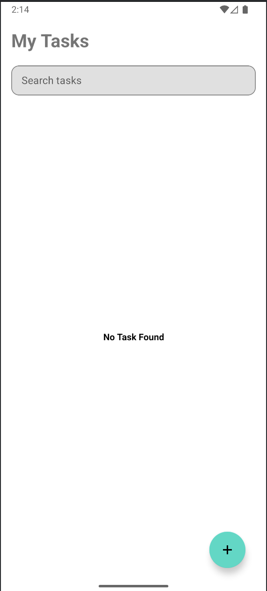
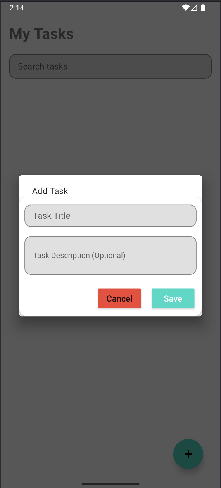
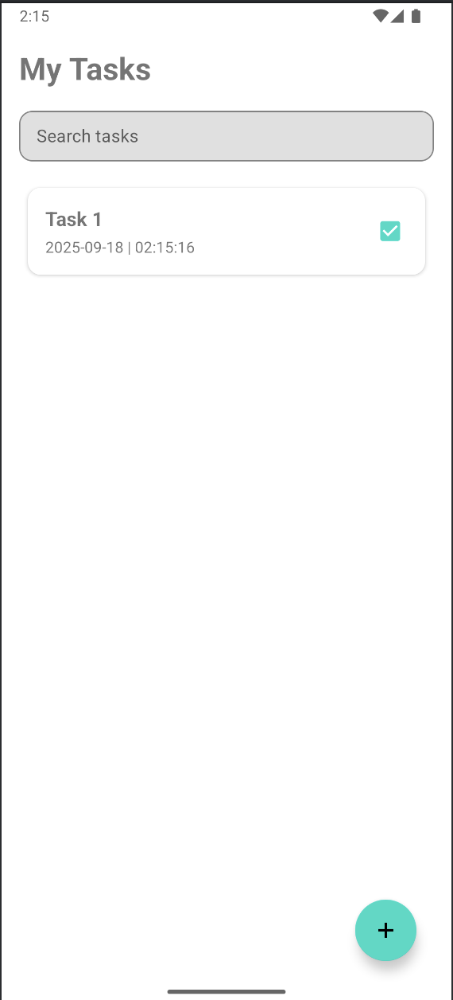
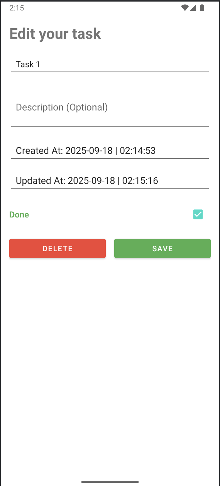
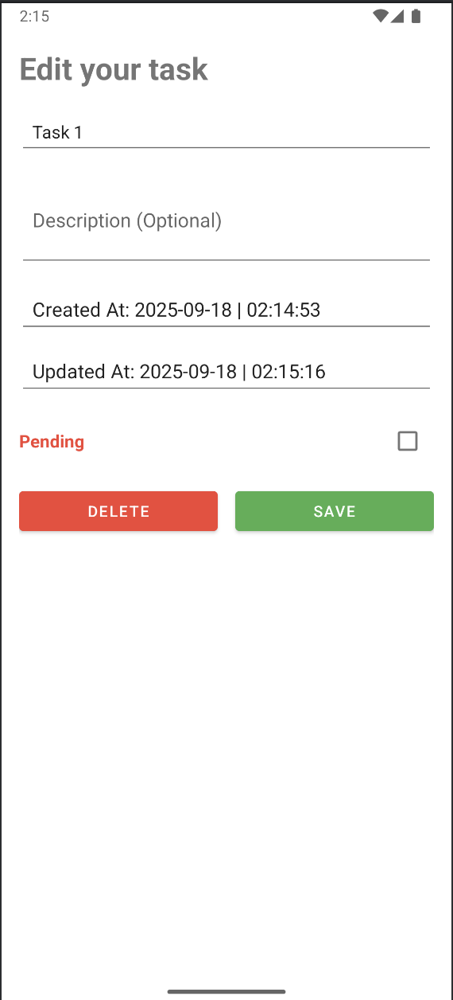
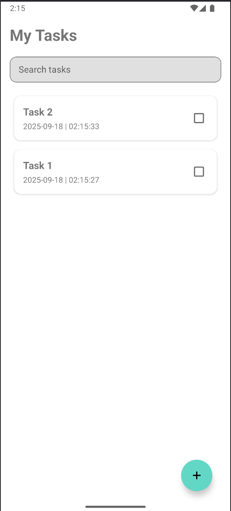
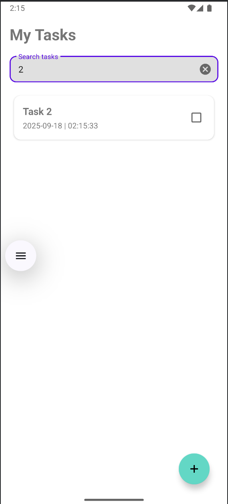

# Task Manager - Android App

A simple yet effective Android application for managing your daily tasks. Built with modern Android development tools and practices.

**📥 Download APK:** [Click here to download](https://github.com/Him-anshuSharma/fynocrat-assignment/releases/download/apk/app-debug.apk)

## Demo Video
[Watch the App Demo Video](https://youtu.be/rq1vX8ALldU)

## Table of Contents
* [Screenshots](#screenshots)
* [Architecture](#architecture)
* [Setup & Installation](#setup--installation)

## Screenshots
### 1. Home Screen


### 2. Add Task


### 3. Task List


### 4. Check Task


### 5. Edit Task 


### 6. Uncheck Task


### 7. All Tasks


### 8. Search Tasks


## Tech Stack & Libraries
* **UI:**
    * XML with ViewBinding (for `MainActivity`, `TaskDetails`)
    * `RecyclerView` for displaying task lists
* **Asynchronous Programming:** Kotlin Coroutines
* **Database:** [Room Persistence Library](https://developer.android.com/training/data-storage/room) for local SQLite database
* **Dependency Injection:** [Hilt](https://developer.android.com/training/dependency-injection/hilt-android) (as seen in `@AndroidEntryPoint` and `@HiltViewModel`)
* **Jetpack Components:**
    * ViewModel
    * LiveData or StateFlow/SharedFlow
    * Navigation via `Intent` between Activities
    * Lifecycle-aware components

## Architecture

This project follows the **Model-View-ViewModel (MVVM)** architecture pattern:

* **Model:** Represents the data and business logic:
    * `Task` data class (Room Entity)
    * `TaskDao` (Data Access Object)
    * `TaskDatabase` (Room database)
    * `TaskRepository` (optional, single source of truth)
* **View:** Represents the UI:
    * `MainActivity.xml`, `TaskDetails.xml`, `item_task.xml` (Layouts)
    * `MainActivity.kt`, `TaskDetails.kt` (Activities observing ViewModel)
    * `TaskListAdapter.kt` (RecyclerView Adapter)
* **ViewModel:** Acts as a bridge between Model and View:
    * `TaskViewModel.kt` 
    * `TaskDetailsViewModel.kt` (manages temporary edits, UI state)


## Setup & Installation

1. **Clone the repository:**
```bash
git clone https://github.com/Him-anshuSharma/fynocrat-assignment/